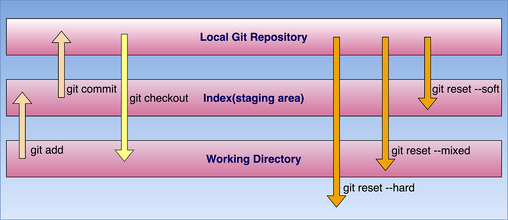

__Fork do repositório sobre [Git e GitHub de Gustavo Guanabara](https://github.com/gustavoguanabara/git-github).__
---

# Curso Grátis de Git e GitHub
Material do **Curso de Git e GitHub**, disponível gratuitamente no canal do *YouTube* [Curso em Vídeo](https://www.youtube.com/watch?v=xEKo29OWILE&list=PLHz_AreHm4dm7ZULPAmadvNhH6vk9oNZA).

Material [git-status.sh](https://github.com/fernandomartinscardoso/git-github/blob/main/git-status.sh) é um exemplo de bash script para checagem de status de repositórios em sistemas Linux.

## Resumo dos principais pontos do curso

Git e GitHub são coisas diferentes. Git é um software de controle de versão (VCS), já o GitHub é uma plataforma de rede social para programadores.

### Git

Git é uma plataforma de versionamento de código. Para o programador, versionamento é um conceito importante porque ele está sempre lidando com muitas versões de uma mesma coisa. Para se salvar uma versão de uma pasta de trabalho local para um reporitório central, é necessário comissionar essa pasta, ou seja, fazer um `commit`.

O primeiro VCS que surgiu era do tipo centralizado ou linear, o que significa ter o comissionamento feito por computadores conectados fisicamente ao servidor do repositório. 

Esse modelo evoluiu para uma forma de VCS do tipo distribuído, ou seja, em que o comissionamento é feito em repositórios locais instalados nos computadores dos desenvolvedores. Para unificar o projeto, os repositórios locais enviam para um repositório remoto, numa operação denominada `push`.

Principais VCS's do tipo centralizado: Concurrent Version System (CVS) e Apache Subversion (SVN).  
Principais VCS's do tipo distribuído: BitKeeper e Git.

Principais vantagens dos VCS's:

- Controle de histórico;
- Trabalho em equipe;
- Ramificação do projeto;
- Segurança;
- Organização.

### GitHub

Enquanto o Git é o sistema para versionar os arquivos, salvá-los e enviá-los remotamente, o próprio repositório remoto é o __GitHub__, que também funciona como plataforma de exposição do trabalho e comunidade para troca de informações.

O GitHub disponibiliza repositórios ilimitados, hospedagem de código-fonte, apresenta características de rede social, GitHub Pages integrado (que dá pra hospedar sites com recursos básicos gratuitamente), tem recurso de colaboração para projetos compartilhados e os forks para criar derivação de projeto.

Opções concorrentes do GitHub: GitLab, Bitbucket, PHABRICATOR, Gogs, kallithea, entre outros.

Para se usar o Git com interface gráfica integrada à conta do GitHub, pode-se usar o [GitHub Desktop](https://github.com/apps/desktop).

## Método para limpar ou deletar um commit completamente:

No artigo da medium.com (ver __Referências__) há o esquemático da <a href="#git_commands">Figura 1</a> abaixo mostrando o que os principais comandos fazem, em termos de versionar o que foi alterado entre o diretório de trabalho e o repositório local. Como se pode ver, o _hard reset_ exclui os dados até mesmo do diretório de trabalho, sem poder ser recuperado, portanto, atente-se aos passos abaixo para deletar o commit desejado sem excluir dados importantes definitivamente:

- Listar o log para ter acesso aos códigos SHA-1 de cada commit: `git log --all`
- Usar o código SHA-1 como referência para resetar o commit escolhido: `git reset --hard REF`

## Referências

[Atlassian Git Tutorial](https://www.atlassian.com/git/tutorials/setting-up-a-repository/git-clone)

[Badges for README files](https://shields.io/)

[Ícones que podem ser usados nos Badges](https://simpleicons.org/)

[Git Basics Documentation](https://git-scm.com/book/en/v2/Git-Basics-Getting-a-Git-Repository)

[How to Undo the Last Commit using git reset Command?](https://medium.com/@basecs101/how-to-undo-the-last-commit-using-git-reset-command-latest-f917f5e9c554)
